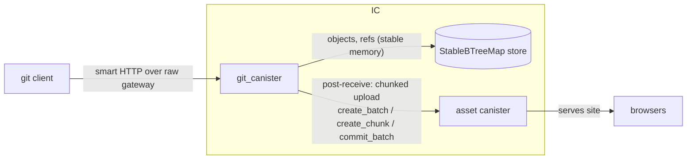

# ic-git - a minimal git remote on an Internet Computer canister

A single Rust canister that speaks git's smart-HTTP protocol, stores objects in
stable memory, and redeploys a stock asset canister whenever `refs/heads/main`
moves. `git clone` / `git push` work with an unmodified git client pointed at
`https://<canister-id>.raw.icp0.io/<repo>.git`.

## Goals / non-goals

**Goals**

- Host public open-source repos: `clone`, `fetch`, `push` with stock git.
- On push to `main`, publish the tree (or a configured subdirectory) to an
  asset canister - merge-to-main *is* the deploy.
- Minimal: one repo type, no issues/PRs/web UI (a read-only file browser can
  come later for free, since the objects are already on-chain).

**Non-goals (v1)**

- Server-side delta storage or optimal packs (we serve non-delta packs).
- Shallow clones, partial clone filters, protocol v2, LFS.
- Build steps. The canister deploys files as they exist in the tree; anything
  that needs `npm build` commits its `dist/` or builds in external CI. (An
  HTTPS-outcall build trigger is a possible v2.)
- Private repos (reads are public queries; auth applies to push only).

## The four ICP constraints that shape everything

| Constraint | Value | Consequence |
|---|---|---|
| Max ingress payload | 2 MiB | A single `git push` packfile must fit in ~1.9 MiB. Large pushes need chunking (see the "Push size" section). |
| Max query response | 3 MiB (streamable) | Clone packfiles are served via the HTTP gateway's **streaming callback** - unlimited total size, ~2 MiB per chunk. |
| Instructions per call | 5 B query / 40 B update (DTS) | zlib inflate/deflate of a few MiB per call is fine; pack generation for huge repos must be chunk-incremental (streaming naturally provides this). |
| Certification on non-raw gateway | required | Serve on `*.raw.icp0.io` in v1. This is not the weak point it looks like - see the "Trust model" section. Integrity comes from signed tags (now) and certified ref advertisements + verifying clients (v2), not from which gateway domain we use. |

Reads (`clone`/`fetch`) are **query calls** - free-ish, fast, streamable.
Writes (`push`) are **update calls** via `http_request_update` - consensus,
2 MiB-capped, cycles-metered. This asymmetry is why the design favors doing
all the clever work on the read path and keeping the write path dumb.

## Components



- **`git_canister`** (Rust, `ic-cdk` + `ic-stable-structures` +
  [`ic-dev-kit-rs`](../ic-dev-kit-rs)): HTTP endpoints, pkt-line codec,
  packfile reader/writer, object store, refs, push auth, deploy trigger.
  Multi-repo: path prefix `/<repo>.git/...` keys everything.
  From the dev kit: `http` (request/response types, `upgrade_response()`,
  routing helpers), `auth` (principal allowlist guarding the candid admin
  API, persisted across upgrades), and later `large_objects` (chunked
  uploads, see the "Push size" section) and `telemetry`. Gap to add upstream: the dev
  kit's `HttpResponse` has no `streaming_strategy` field yet - required for
  milestone 2's streamed clone responses.
- **asset canister**: the stock certified-assets canister from the SDK
  (`dfx`'s frontend canister). `git_canister`'s principal is granted `Commit`
  permission so it can upload. Zero custom code here.
- **(v2) `git-remote-ic`**: a git remote-helper binary that talks to the
  canister with agent calls (chunked, identity-signed) instead of HTTP -
  lifts the 2 MiB push limit and replaces token auth with II/ed25519
  identities. Not needed for v1.

## Data model (stable memory)

Everything content-addressed and loose - no server-side packs, no GC needed
because objects are immutable and refs only add reachability.

```
objects  : StableBTreeMap<[u8;20], Vec<u8>>   // SHA-1 -> zlib-deflated "type len\0" + body
refs     : StableBTreeMap<(RepoId, String), [u8;20]>   // "refs/heads/main" -> oid
repos    : StableBTreeMap<RepoId, RepoMeta>   // HEAD symref, deploy config, created_at
tokens   : StableBTreeMap<[u8;32], TokenMeta> // sha256(push token) -> repo perms
deploy_q : StableVec<DeployJob>               // pending deploys (see the Deploy section)
```

At 500 GiB stable memory and ~$5/GiB-year storage cost, capacity is not the
issue; per-message throughput is.

RepoMeta carries the deploy config, read from `.ic-deploy.json` at the repo
root on each main update (fall back to defaults):

```json
{ "source_dir": "dist", "asset_canister": "<principal>", "branch": "main" }
```

## Protocol: what we implement

Smart HTTP, protocol v0/v1 - four routes:

| Route | Call type | Purpose |
|---|---|---|
| `GET /<r>.git/info/refs?service=git-upload-pack` | query | ref advertisement for clone/fetch |
| `POST /<r>.git/git-upload-pack` | query(1) | want/have negotiation -> packfile (streamed) |
| `GET /<r>.git/info/refs?service=git-receive-pack` | query | ref advertisement for push |
| `POST /<r>.git/git-receive-pack` | **update** (`upgrade=true`) | ref update commands + packfile in |

(1) upload-pack is read-only, so it stays a query. The POST body (wants/haves)
is well under limits; the *response* streams.

Advertised capabilities, deliberately tiny:
`report-status delete-refs ofs-delta agent=ic-git/0.1` on receive-pack;
`multi_ack_detailed no-done ofs-delta agent=ic-git/0.1` on upload-pack.
We do **not** advertise `shallow`, `filter`, or `side-band-64k`... actually we
**do** want `side-band-64k` on upload-pack (progress + data mux is how every
real server streams packs; git handles it natively).

### Clone/fetch path (query, streaming)

1. Parse wants/haves; walk commits from wants, stopping at haves, collecting
   the closure of commits + trees + blobs + tags. Plain BFS over the object
   store; no bitmaps in v1.
2. Emit a packfile with **no deltas**: header, then each object as
   `type+size varint` + zlib-deflated body (we store bodies already deflated -
   recompression is avoidable by storing raw zlib streams compatible with pack
   entries), trailing SHA-1.
3. Serve via the HTTP gateway streaming strategy: the first response carries
   the first ~1.5 MiB and a callback token `{repo, pack_id, offset}`; the
   gateway keeps calling `http_request_streaming_callback` until done. Pack
   state between callbacks is recomputed deterministically from the token
   (object list is re-derived or cached in a bounded LRU in heap - heap cache
   is fine to lose on upgrade).

Cost: clones of a repo with tens of thousands of objects fit comfortably in
the 5 B-instruction query budget per chunk since each chunk only inflates ~2 MiB.

### Push path (update)

1. `http_request` sees POST to `git-receive-pack`, returns `upgrade = true`;
   the gateway re-sends it as `http_request_update`.
2. Parse pkt-lines: `old-oid new-oid refname` commands, then the packfile.
3. Index the pack: inflate each entry; resolve `OFS_DELTA` against earlier
   entries in the same pack and `REF_DELTA` against the object store (this
   also handles **thin packs**, which git sends by default - bases may live
   only server-side). Verify SHA-1s. Store every resulting object loose.
4. Check fast-forward (walk new commit's ancestry for old oid; reject
   non-ff unless force and token allows), update refs atomically, reply with
   `report-status`.
5. If `refs/heads/main` changed -> enqueue `DeployJob { repo, commit }` and
   `ic_cdk_timers::set_timer(0, run_deploy_queue)` so the push response
   returns immediately.

**Push size (the honest limitation):** one push <= ~1.9 MiB of pack. Three
escalating answers:

1. **v1:** document it, and ship a `tools/ic-push.sh` that splits history into
   <=1.5 MiB increments by pushing intermediate commits
   (`git push origin <rev>:refs/heads/main` walking forward) - stock git only.
2. **v1.5:** chunked candid path using the dev kit's `large_objects` module -
   a wrapper script packs locally (`git pack-objects`), uploads the pack in
   chunks via `dfx canister call` (parallel chunks supported), then calls a
   `receive_pack_from_buffer` update that runs the same indexer as the HTTP
   path. No 2 MiB limit, no custom protocol code, works before the remote
   helper exists. (`large_objects` buffers live on the wasm heap, so
   finalize before any canister upgrade.)
3. **v2:** the `git-remote-ic` helper makes this transparent behind
   `git push`.

### Deploy path (timer-driven, inter-canister)

Runs from the timer, not inside the push call - pushes stay fast and the 40 B
instruction budget per deploy step is fresh.

1. Load `.ic-deploy.json` from the pushed commit's tree; resolve `source_dir`.
2. Walk that subtree; diff against the asset canister's current `list()` by
   sha256 - only changed files upload.
3. `create_batch` -> `create_chunk` (<= ~1.9 MiB per chunk, inter-canister
   same-subnet allows up to 10 MiB but stay conservative cross-subnet) ->
   `commit_batch` with content-type from extension, gzip encoding for text
   types. Atomic flip on commit - no partially-deployed site.
4. A job that exhausts its instruction budget re-arms the timer and resumes
   from a stored cursor (batch id + remaining paths). Failures leave the queue
   entry with an error for `deploy_status` query to report.

Setup requirement: the asset canister must `grant_permission(Commit)` to the
git canister's principal (one-time, done by `dfx` in the deploy script).

### Trust model (why raw-domain is not the weak point)

Who can tamper with what a cloner receives?

- **The subnet/canister:** standard IC consensus trust; nothing git-specific.
- **The boundary-node HTTP gateway:** with a *stock git client*, this is the
  trust boundary - and certification cannot move it. Certificate verification
  for non-raw domains happens *inside the gateway itself*, so serving
  certified responses on `icp0.io` vs uncertified on `raw.icp0.io` changes
  nothing about what a stock client can prove: the client trusts whatever
  bytes the gateway hands it either way. Raw is therefore not a security
  downgrade for git traffic; it's an honest label on an existing trust
  relationship. (Verified locally: dfx's gateway returns 503 for uncertified
  responses on `<id>.localhost` and serves them fine on `<id>.raw.localhost`
  - raw is required until item 2 below lands.)
- **What a malicious gateway can actually do:** it cannot fabricate objects
  matching a commit hash the client already trusts (that's a SHA-1 preimage),
  but it *can* serve stale refs, hide branches, or advertise a fabricated
  alternate history for refs the client has never pinned. The ref
  advertisement is the security-critical surface.

Mitigations, in deployment order:

1. **v1 - signed commits/tags.** Git-native, end-to-end,
   transport-independent, works today. Recommended in the README regardless
   of everything below.
2. **v1.5 - certify the `info/refs` advertisement.** Refs only change at push
   time, so recomputing `set_certified_data` over the advertisement is cheap
   and fits the update call that's already running. A *verifying* client
   (local IC HTTP gateway, or anything built on the `ic-http-gateway`
   library) then gets tamper-proof refs - and given trusted refs, the pack
   stream is self-verifying via SHA-1. Stock clients are unaffected either
   way. The packfile response itself stays uncertified (it's
   negotiation-dependent and self-verifying, so certifying it buys nothing).
3. **v2 - `git-remote-ic`** issues certified query calls and identity-signed
   updates directly: full end-to-end verification with no local gateway,
   plus private repos and unlimited push size.

### Auth

- Reads: public, no auth.
- Push: HTTP Basic - username ignored, password is a bearer token; canister
  stores `sha256(token)`. Minted by the repo owner via a candid
  `create_token` update call (caller principal = owner). Raw-domain HTTPS
  terminates at the boundary node, so the token transits boundary-node
  infrastructure in cleartext at that hop; acceptable for
  public-repo push auth in v1, replaced by identity-signed calls in the v2
  remote helper.

## Implementation notes

- **Crates**: `ic-dev-kit-rs` (path dep on `../ic-dev-kit-rs` during
  development, git tag once stable), pinned to its versions: `ic-cdk 0.20`,
  `candid 0.10`, `ic-stable-structures 0.7`. Plus `ic-cdk-timers` (deploy
  queue), `flate2` (rust-backend/miniz_oxide - pure Rust, wasm-clean),
  `sha1`, `sha2`, `hex`.
  Try `gix-object`/`gix-hash` from gitoxide for object parsing (pure Rust,
  likely compiles to `wasm32-unknown-unknown`); hand-roll the pack
  reader/writer regardless - it's ~500 lines and the streaming/token design
  is IC-specific anyway.
- **pkt-line** is trivial: 4 hex length bytes + payload; `0000` flush.
- Keep hot parsing state in heap; only committed objects/refs touch stable
  structures. Canister upgrades then can't strand a half-parsed pack.
- SHA-1 only in v1 (matches git default); SHA-256 repos out of scope.

## Milestones

1. **Skeleton + store** - canister with candid admin API: put/get object,
   set ref, list refs. Unit tests with `pocket-ic`.
2. **Clone** - pkt-line codec, ref advertisement, upload-pack with streaming
   pack writer. Seed objects via admin API; `git clone` from raw URL works.
3. **Push** - receive-pack: pack indexer with delta resolution (incl. thin
   packs), ff-check, report-status. Round-trip: push then re-clone,
   `git fsck` clean.
4. **Deploy hook** - timer queue, tree walk, asset-canister batch upload,
   `.ic-deploy.json`. Push to main -> site updates.
5. **Auth + polish** - push tokens, multi-repo routing, `ic-push.sh` splitter,
   cycles/limits docs.
6. **(v2)** `git-remote-ic` helper: chunked, identity-signed push; private
   repos; certified read responses.

## Open questions

- Store object bodies as pack-entry-compatible zlib streams to make the pack
  writer zero-copy? (Saves recompression on every clone - probably yes.)
- Negotiation completeness: `multi_ack_detailed` has fiddly edge cases; v1
  could legally always send a full pack (correct, wasteful) and refine.
- Per-chunk streaming determinism: cache the computed object list keyed by
  `pack_id`, or make the walk order deterministic and recompute per callback?
  (Recompute is simpler and query-cheap; start there.)
